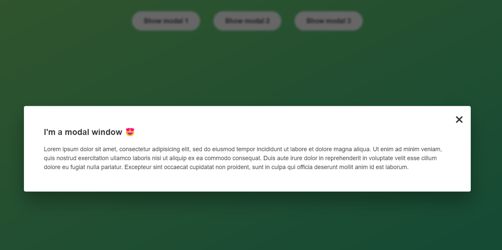

# modal-window-study

Section 7 - Lesson 79 Project #2 Modal Window

### Links

- Live Site URL: [Click here](https://ciisiq.github.io/studying-guess-my-number-game/)

### What I learned

I learned about modal window in javaScript 

- What is it?
  A modal is a dialog box/popup window that is displayed on top of the current page 
  [Read more](https://www.w3schools.com/howto/howto_css_modals.asp)

### Result Screenshot

  
